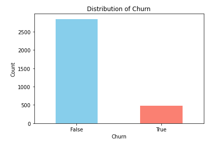

# SyriaTel Customer Churn Prediction

## 1. Overview

The objective of this project is to predict customer churn for SyriaTel and identify key factors contributing to churn. By accurately predicting which customers are likely to leave the company, SyriaTel can take proactive steps to retain these customers, thus improving customer satisfaction and reducing revenue loss.

## 2. Business and Data Understanding
### Business Problem

SyriaTel has been experiencing a significant number of customers leaving the company, also known as customer churn. To stay ahead of this issue, SyriaTel aims to predict customer churn and understand the factors driving it. This will enable key teams—such as the CRM, Marketing, and Customer Service/Support teams—to design targeted interventions that prevent customers from leaving.

### Stakeholder Audience

 - **CRM Team:** Focused on designing retention strategies to keep at-risk customers.
 - **Marketing Team:** Uses churn predictions to create personalized campaigns targeting customers at risk of leaving.
 - **Customer Service/Support Team:** Proactively addresses issues with at-risk customers to improve service quality and prevent churn.

### Dataset Choice
The dataset used in this project contains a variety of customer information, including usage patterns, service plans, and interactions with customer service. The data provides a comprehensive view of customer behavior and their interactions with SyriaTel's services, which are crucial for identifying churn drivers and predicting churn accurately.

The image represents the customer churn from the dataset:

## 3. Modeling
### Approach
To predict customer churn, we utilized classification models. Classification is particularly useful in this context as it allows us to categorize customers into those who are likely to churn and those who are not. This binary classification problem was approached using three models:

 **1. Baseline Model - Logistic Regression:**
 
  - A simple, interpretable model that serves as a baseline for comparison.

 **2. Decision Tree Model:**

  - A more complex model capable of capturing non-linear relationships. However, it is prone to overfitting.

 **3. Tuned Decision Tree Model:**

  - The Decision Tree model was further refined through hyperparameter tuning to reduce overfitting and improve generalization.

### Modeling Methodology
 - **Data Preprocessing:** The data was cleaned, and features were engineered to enhance the predictive power of the models. Features were scaled and categorical variables were encoded appropriately.
 - **Model Training:** Each model was trained on a subset of the data, with the performance being evaluated on both training and testing datasets.
 - **Hyperparameter Tuning:** The Decision Tree model was fine-tuned using GridSearchCV to find the optimal parameters that balance model complexity and performance.

## 4. Evaluation
### Key Metrics

The performance of each model was evaluated using the following metrics:

 - **Accuracy:** Measures the overall correctness of the model’s predictions.
 - **Precision:** Indicates the proportion of true positives among the predicted positives, showing how many of the predicted churners actually churned.
 - **Recall:** Measures the model’s ability to identify actual churners, which is critical in minimizing customer loss.
 - **F1-Score:** Provides a balance between precision and recall, giving a single metric that accounts for both.
 - **ROC-AUC:** Represents the model's ability to distinguish between churners and non-churners across all classification thresholds.

### Model Comparison
 - **Logistic Regression:** This model showed good accuracy but struggled with recall, meaning it missed many actual churners.
 - **Decision Tree:** While it had excellent recall on the training data, it was highly overfitted, making it less reliable for generalization.
 - **Tuned Decision Tree:** This model offered a good balance between precision and recall with reduced overfitting, making it the most reliable model for predicting customer churn in this project.

## 5. Conclusion
The Tuned Decision Tree model was identified as the best model for predicting SyriaTel customer churn. It strikes an effective balance between accuracy, precision, and recall while mitigating the risk of overfitting seen in the initial Decision Tree model. This model is well-suited for deployment, where it can be used to proactively identify at-risk customers, allowing SyriaTel to implement targeted retention strategies.

### Key Takeaways:
 - **Proactive Retention:** The model enables SyriaTel to take early action to retain customers who are likely to churn.
 - **Churn Drivers:** The analysis identified key factors contributing to churn, such as high service charges and frequent customer service calls, which should be addressed to reduce churn rates.
 - **Continuous Improvement:** Regular retraining and monitoring of the model will ensure it adapts to changes in customer behavior, maintaining its effectiveness over time.